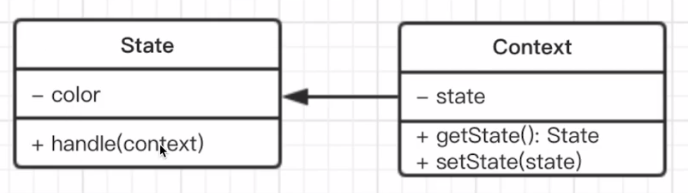

# design-pattern-test

# 视频教程地址 : https://www.bilibili.com/video/BV1st4y127Uz?p=30

# 环境：使用 webpack+babel 搭建 es6,（typescript）环境

# 前提：

## 面向对象三要素

### 继承，子类继承父类（extends) ：

- 父类服务于所有子类
- 继承可以将公共方法抽离，提高复用，减少冗余

### 封装，数据的权限和保密：

- public 完全开放
- protected 对子类开放
- private 对自己开放

作用：

- 减少耦合，不该外露的不外露
- 利于数据、接口的权限管理
- ES6 目前不支持，一般认为\_开头的属性的 private

### 多态，同一接口不同实现：

作用：

- 同一接口，不同表现
- JS 应用极少
- 需要结合 java 等语言的接口、重写、重载等功能

## 画类图

### 工具：

- MS Office visio
- https://www.processon.com/

#### UML 类图

例如：  
|类名|  
| ------- |
| +public 属性名：类型 |  
| #protected 属性名：类型 |  
| -private 属性名：类型 |  
| —————————————————— |
| +public 方法名(形参们)：返回值类型 |  
| #protected 方法名(形参们)：返回值类型|  
| -private 方法名(形参们)：返回值类型 |

- 类图：属性和方法
- 关系：泛化和关联

# 设计模式

## 设计原则

### 1. 何为设计？

#### 描述：

a. 即按照哪一种思路或者标准来实现功能  
b. 功能相同，可以有不同设计方案来实现  
c. 伴随着需求增加，设计的作用才能体现出来

#### 结合《UNIX/LINUX 设计哲学》：

准则 1：小即是美  
准则 2: 让每个程序只做好一件事  
准则 3：快速建立原型  
准则 4：舍弃高效率而取可移植性【复用性>效率】  
准则 5：采用纯文本来存储数据【可读性】  
准则 6：充分利用软件的杠杆效应（软件复用）  
准则 7：使用 shell 脚本来提高杠杆效应和可移植性  
准则 8：避免强制性的用户界面【设计不要拘泥在显示上，更多在逻辑和使用全面上考虑】  
准则 9：让每个程序都称为过滤器

小准则：允许用户定制环境【允许用户配置不同的使用环境】  
小准则：尽量使操作系统内核小而轻量化【中心内容集中】  
小准则：使用小写字母并尽量简写【命名规范】  
小准则：沉默是金【不是正确的输入、或者输出不要返回 《==== 每个都是过滤器，如果有输出会影响之后的结果】  
小准则：各部分之和大于整体【组合利益更重要】  
小准则：寻求 90%的解决方案【二八定律，20%的成本解决 80%的需求，接下来 20%需要更多成本】

### 2. 设计原则

SOLID 五大设计原则：

- Single:单一职责原则  
  描述：  
  一个程序只做好一件事  
  如果功能过于复杂就拆分开，每个部分保持独立

- Open:开放封闭原则  
  描述：  
  对扩展开放，对修改封闭  
  增加需求时，扩展新代码，而非修改已有代码  
  重要性：是软件设计的终极目标

- Lee:李氏置换原则  
  描述：  
  子类能覆盖父类  
  父类能出现的地方子类就能出现  
  JS 中使用较少（弱类型&继承使用较少）

- Interface:接口独立原则  
  描述：  
  保持接口的单一独立，避免出现“胖接口”  
  JS 中没有接口（ts 例外），使用较少  
  类似于单一职责原则，更关注接口

- Dependence:依赖倒置原则  
  描述：  
  面向接口编程，依赖于抽象而不依赖于具体  
  使用方只关注接口而不关注具体类的实现  
  JS 中使用较少（没有接口&弱类型）

- 总结：  
  SO 体现较多，详细介绍  
  LID 体现较少，只要了解其用意

### 3. 从设计到模式

设计：设计原则，思想  
模式：固定的特有形成的模式  
从设计到模式：过程

_学习基本需要知道:  
该模式的介绍和示例  
UML 类图和演示  
经典使用场景  
设计原则验证_

### 4. 23 种设计模式

a. 创建型：  
1）工厂模式（工厂方法模式，抽象工厂模式，建造者模式）  
工厂模式介绍：

- 将 New 操作 **单独封装**
- 遇到 new 时, 就要考虑是否该使用工厂模式

场景例如：

- jquery $('div') 函数$ 封装了 new selector  
  _tip:  
  阅读经典 lib 源码的意义：  
  学习如何实现  
  学习设计实现  
  学习刻意训练  
  创新和拿来主义：  
  模仿，理解_

- React.createElement
  createElement 封装了 new Vnode 节点的操作

- Vue: Vue component

设计原则验证：

- 构造函数和创建者分离
- 符合开放封闭原则

2）单例模式
介绍：

- 系统中被**唯一**使用
- 一个类只有**一个**实例

说明：

- java 中强烈依赖 private 特性
- javascript 中利用闭包，来保证只创建一个实例

场景：

- jquery 只有一个 \$
- 模拟登录框
- 其他： 购物车，vuex 和 redux 中的 store

设计原则验证：

- 符合单一职责原则，只实例化唯一的对象
- 没法具体开放封闭原则，但是绝对不违反开放封闭原则

3）原型模式

b. 组合型（结构型）：  
1）适配器模式  
介绍：

- 旧接口格式和使用者不兼容
- 中间加一个适配转换接口  
  _类似中国电器拿到了日本，需要一个电源转换器（适配器）_

场景：

- 封装旧接口
- vue computed

设计原则验证：

- 将旧接口和使用者进行分离
- 符合开放封闭原则

2）装饰器模式  
介绍：

- 为对象添加新功能
- 不改变其原有的结构和功能  
  _手机的手机壳_

场景：

- ES7 装饰器
  配置环境：

  ```js
  npm install --save-dev @babel/plugin-proposal-decorators
  ```

  在配置文件.babelrc 上配置：

  ```
  "plugins": [
   ["@babel/plugin-proposal-decorators", {"legacy": true }]
  ]
  ```

  装饰类：

  ```js
  @testDec
  class Demo {}

  function testDec(target) {
    target.isDec = true;
  }
  alert(Demo.isDec);
  ```

  装饰方法：

  ```
  class Person {
    constructor() {
      this.first = 'A'
      this.last = 'a'
    }

    // 装饰方法
    @readOnly
    name() {
      return `${this.first} ${this.last}`
    }
  }
  var p = new Person()
  p.name = function(){}
  // 会报错，name为只读属性
  function readOnly(target, name, descriptor) {
    descriptor.writable = false;
    return descriptor;
  }

  ```

  装饰方法的三个形参：
  

- core-decorators 库
  第三方开源 lib
  提供常用的装饰器
  安装： `npm i core-decorators --save`

  使用：

  ```
  import {readonly} from 'core-decorators'
  class Person{
    @readonly
    name(){


    }
  }

  ```

设计原则验证：

- 将现有对象和装饰器进行分离，两者独立存在
- 符合开放封闭原则

3）代理模式  
介绍:

- 使用者无权访问目标对象
- 中间加代理，通过代理做授权和控制
  

UML 类图:


场景:

- 网页事件代理
- jQuery \$.proxy
- ES6 proxy

设计原则验证：

- 代理类和目标类分离，隔离开目标类和使用者
- 符合开放封闭原则

#### 对比 代理模式 和 适配器模式/装饰器模式

| 代理模式           | 适配器模式                           |
| ------------------ | ------------------------------------ |
| 提供一模一样的接口 | 提供一个不同的接口（不同接口的插头） |

| 代理模式                                                 | 装饰器模式                         |
| -------------------------------------------------------- | ---------------------------------- |
| 显示原有的功能，但是是经过限制或者阉割【修改】之后的功能 | 扩展功能，原有功能不变且可直接使用 |

4）外观模式
介绍：

- 为子系统中的一组接口提供了一个高层接口
- 使用者使用这个高层接口
  【提供一条龙的服务】
  

UML 类图:


场景：

```
// 提供统一的接口，
function bindEvent(elem, type, selector, fn){
  if (fn === null) {
    fn = selector;
    selector = null;
  }
}
bindEvenet(elem, 'click', '#div1', fn)
```

设计原则验证：

- 不符合单一职责原则和开放封闭原则，因此谨慎使用，不可滥用

5）桥接模式  
6）组合模式  
7）享元模式

c.行为型：

行为型-1  
 1）策略模式  
 2）模板方法模式  
 3）观察者模式 \*\*\*【前端使用最多的一种】  
 介绍：

- 发布 & 订阅
- 一对多

UML 类图：


场景：

- 网页事件绑定 可以同一事件绑定多个触发事件
- Promise 执行操作写在.then 里面
- jQuery callbacks 底层\$.Callbacks, ajax 什么的都是用的这个
- nodejs 自定义事件【EventEmitter】
- nodejs 中处理 Http 请求；多进程通讯
- vue 和 React 组件生命周期触发 【钩子函数】
- vue watch 【set】

设计原则验证：

- 主题和观察者分离，不是主动触发而是被动监听，两者解耦
- 符合开放封闭原则

4）迭代器模式
介绍：

- 顺序访问一个集合 【有序列表】
- 使用者无需知道集合的内部结构（封装）

说明：
同一个方法使用遍历不同的数据结构

场景：

- jquery each
- es6 iterator
  存在的意义：  
   · es6 语法中，有序集合的数据类型已经有很多  
   · Array Map Set String TypedArray arguments NodeList
  `需要有一个统一的遍历接口来遍历所有数据类型 · （tip: object非有序集合，可用map代替） 介绍： · 以上数据类型，都有【Symbol.iterator】属性` 属性值是函数，执行函数返回一个迭代器  
   · 这个迭代器就有 Next 方法可顺序迭代子元素  
   · 可运行 Array.prototype[Symbol.iterator]来测试  
   es6 Iterator 与 Generator:  
  · Iterator 的价值不限于上述几个类型的遍历  
  · 还有 Gnerator 函数的使用  
  · 即只要返回的数据符合 Iterator 接口的要求

设计原则验证：

- 迭代器对象和目标对象分离
- 迭代器将使用者与目标对象隔离开
- 符合开放封闭原则

5）职责连模式  
 6）命令模式

行为型-2  
 1）备忘录模式  
 2）状态模式
介绍：

- 一个对象有状态变化
- 每次状态变化都会触发一个逻辑
- 不能总是用 If ... else 来控制

UML 类图：


场景：

- 有限状态机
- 有限个状态、以及在这些状态之间的变化
- 如交通信号灯
- 使用开源 lib：javascript-state-machine
- github.com/jakesgordon/javascript-state-machine
  npm install --save-dev javascript-state-machine

  ```js
  import StateMachine from "javascript-state-machine";
  import $ from "jquery";

  var fsm = new StateMachine({
    init: "收藏",
    transitions: [
      { name: "dostore", from: "取消收藏", to: "收藏" },
      { name: "deletestore", from: "收藏", to: "取消收藏" },
    ],
    methods: {
      onDostore: function () {
        console.log("收藏");
        updateContext();
      },
      onDeletestore: function () {
        console.log("取消收藏");
        updateContext();
      },
    },
  });

  function updateContext() {
    console.log(fsm);
    // console.log(fsm.allStates())
    // console.log(fsm.state)
    $("#btn1").text(fsm.state);
  }

  $(document).ready(() => {
    console.log("ready");
    $("body").append('<button id="btn1"></button>');
    $("#btn1").unbind();
    $("#btn1").bind("click", function () {
      if (fsm.is("收藏")) {
        fsm.deletestore(); // 必须写成不带on的
      } else {
        fsm.dostore();
      }
    });
    updateContext();
  });
  ```

- 写一个简单的 promise

  - promise 的语法
    new Promise(funciton (resolve, reject) {
    resolve() // 成功的调用
    reject() // 失败的调用
    }).then(还是一个 promise).catch(还是一个 promise)
  - 分析： promise 就是一个有限状态机
    · Promise 三种状态： pending fullfilled(成功调用 resolve 函数) rejected（失败调用 reject 函数）
    · pending->fullfilled 或 pending -> rejected
    ` 不能逆向变化

  ```js
  import StateMachine from "javascript-state-machine";

  let fsm = new StateMachine({
    init: "pending",
    transition: [
      { name: "resolve", from: "pending", to: "fullfilled" },
      { name: "reject", from: "pending", to: "rejected" },
    ],
    methods: {
      onResolve(state, data) {
        // state - 当前状态机的实例
        // data - xxx 【fsm.resolve(xxx)】 传递的参数
        // 在这 data -> MyPromise
        data.successList.forEach((fn) => fn());
      },
      onReject(state, data) {
        data.failList.forEach((fn) => fn());
      },
    },
  });

  class MyPromise {
    constructor(fn) {
      this.successList = [];
      this.failList = [];

      fn(
        function () {
          fsm.resolve(this);
        },
        function () {
          fsm.reject(this);
        }
      );
    }
    then(resolve, reject) {
      this.successList.push(resolve);
      this.failList.push(reject);
    }
  }

  // test
  function loadImg(src) {
    const promise = new Promise(function (resolve, reject) {
      let img = document.createElement("img");
      img.onload = function () {
        resolve(img);
      };
      img.onerror = function () {
        reject(img);
      };
      img.src = src;
    });
    return promise;
  }
  let src =
    "https://ss1.bdstatic.com/70cFvXSh_Q1YnxGkpoWK1HF6hhy/it/u=3363295869,2467511306&fm=26&gp=0.jpg";
  let result = loadImg(src);
  result.then(
    function () {
      console.log("success");
    },
    function () {
      console.log("fail");
    }
  );
  result.then(
    function () {
      console.log("success2");
    },
    function () {
      console.log("fail2");
    }
  );
  ```

设计原则验证：

- 将状态对象和主题对象分离，状态的变化逻辑单独处理
- 符合开放封闭原则

3）访问者模式  
4）中介者模式  
5）解释器模式

### 5.其他设计模式概述

- 不常用
- 对应不到经典的应用场景

学习：

- 写代码
- 理解设计模式的目的和用意

1. 原型模式  
   介绍：

- clone 自己，生成一个新对象
- java 默认有 clone 接口，不用自己实现

场景：

- js 中 Object.create
  对比 js 中的原型 prototype
- prototype 可以看作 es6 class 的一种底层原理
- 但是 class 是实现面向对象的基础，并不是服务于某个模式
- es6 全面普及之后，大家可能会忽略 prototype
- Object.create 会永久保留，但是 prototype 不一定

2. 桥接模式  
   介绍：

- 用于把抽象化与实现化解耦
- 使得二者可以独立变化
- （没有在 JS 中找到经典应用）【业务中比较常见】

设计原则验证：

- 抽象和实现分离，解耦
- 符合开放封闭原则

3. 组合模式  
   介绍：

- 生成树形结构，表示“整体-部分”关系
- 让整体和部分都具有一致的操作方式【相同的 API...】

演示：

- js 经典应用中，没有找到非常复杂的数据类型
- 虚拟 DOM 中的 vnode 是这种形式，但是数据类型简单
- （用 JS 实现一个菜单，并不算经典应用，与业务相关）

- 整体和单个节点的操作是一致的
- 整体和单个节点的数据结构也是保持一致的

设计原则验证：

- 将整体和单个节点的操作抽象出来
- 符合开放封闭原则

4. 享元模式  
   介绍：

- 共享内存（主要考虑内存，而非效率）
- 相同的数据，共享使用
- （没有在 JS 中找到经典应用）

设计原则验证：

- 将相同的部分抽象出来
- 符合开放封闭原则

5. 策略模式  
   介绍：

- 不同策略分开处理
- 避免出现大量 if ...else 或者 switch...case
- （没有在 JS 中找到经典应用）【具体使用什么模式、方法看业需求】

设计原则验证：

- 不同策略，分开处理，而不是混合在一起
- 符合开放封闭原则

6. 模板方法模式和职责链模式  
   模板方法模式：  
   顺序处理，统一封装成一个流程，统一返回结果

职责链模式：  
介绍：

- 一步操作可能分为多个职责角色来完成
- 把这些角色分开，然后用一个链串起来
- 将发起者和各个处理者、处理者和处理者之间进行隔离

场景：

- js 中的链式操作
- jquery 的链式操作，promise.then 的链式操作

设计原则验证：

- 发起者于各个处理者进行隔离
- 符合开放封闭原则

7. 命令模式  
   介绍：

- 执行命令时，发布者和执行者分开
- 中间加入命令对象，作为中转站

场景：

- 网页富文本编辑器操作，浏览器封装了一个命令对象
- document.execCommand('bold') 加粗
- document.execCommand('undo') 撤销

设计原则验证：

- 命令对象与执行对象分开，实现解耦
- 符合开放封闭原则

8. 备忘录模式  
   介绍：

- 随时记录一个对象的状态变化
- 随时可以恢复之前的某个状态（如撤销功能）
- 未找到 JS 中经典应用，除了一些工具（如编辑器）

设计原则验证：

- 状态对象与使用者分开，解耦
- 符合开放封闭原则

9. 中介者模式

设计原则验证：

- 将各关联对象通过中介者隔离
- 符合开放封闭原则

10. 访问者模式和解释器模式【基本用不到】  
    访问者模式  
    介绍：

- 将数据操作和数据结构进行分离
- 使用场景不多

解释器模式  
介绍：

- 描述语言语法如何定义，如何解释和编译
- 用于专业场景

### 6.关于面试

非高级： 至少 5 个以上（观察者模式、单例模式、装饰器、适配器...  
日常使用：强制理解、模仿

### 7.综合应用

介绍：

- 使用 jQuery 做一个模拟购物车的示例  
  功能包括：显示购物列表、加入购物车、从购物车删除

涉及的设计模式：

- 工厂模式 单例模式
- 装饰器模式 观察者模式
- 状态模式 模板方法模式 代理模式

UML 类图：

代码演示：-
